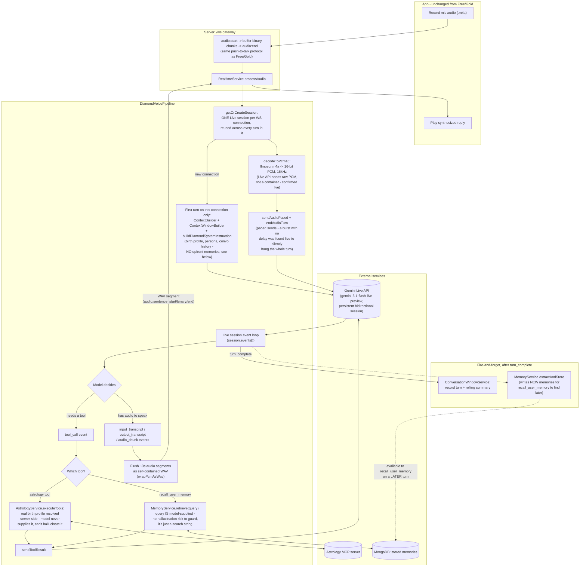

# Diamond Tier — Voice Pipeline

Genuine speech-to-speech via Gemini's Live API: one persistent, bidirectional
model session per WebSocket connection, reused across every turn. No separate
STT, planner, response-generation, or TTS call — the model listens, reasons,
optionally calls astrology or memory-recall tools mid-conversation, and
speaks its own reply, all inside one session.

Entry point: `DiamondVoicePipeline` (`server/src/modules/realtime/pipelines/diamond-voice.pipeline.ts`).

## Data Flow Diagram

## Step by step

1. **App records and uploads** — identical protocol to Free/Gold, confirmed
   live: `audio:start {format:"m4a"}`, binary frame(s), `audio:end`. No
   continuous-streaming mode was needed — the Live API's
   `sendRealtimeInput({audioStreamEnd:true})` (wrapped as
   `LiveSession.endAudioTurn()`) closes out a turn on demand, so push-to-talk
   works fine.
2. **Session reuse, not per-turn setup** — `getOrCreateSession` keeps ONE
   Live session alive for the whole WebSocket connection, keyed by the
   connection object. Only the *first* turn pays the cost of building the
   system instruction and connecting; every later turn on the same
   connection reuses it, so conversation context lives inside the Live
   session itself rather than being rebuilt each turn.
3. **System instruction, built once** (`diamond-system-instruction.ts`) —
   composed from `ContextBuilder.build()` + `ContextWindowBuilder.build()`
   (the same builders Free/Gold's response step uses, called independently
   of the planner): persona base prompt, tool-usage guidance, the
   "kundali" spoken-acknowledgment instructions (masks tool-call latency —
   see below), conversation summary/recent messages, birth/partner profile.
   No memories are proactively injected here — that's handled at runtime
   by the `recall_user_memory` tool instead, see below.
4. **Audio must be raw PCM, 16kHz** — confirmed live the Live API silently
   ignores anything else (no error, just never replies). The app records
   `.m4a` (AAC), so `decodeToPcm16` (via `ffmpeg-static`) decodes it
   server-side before it ever reaches the Live session — Free/Gold don't
   need this since Gemini's regular `generateContent` decodes containers
   itself, but the Live API's realtime input does not.
5. **Paced sending** — confirmed live: sending a whole turn's audio chunks
   in one synchronous burst (no delay between `sendAudioChunk` calls) makes
   the API accept everything and then emit *zero events for the rest of the
   turn*, silently, forever. A small delay between chunks avoids it.
6. **The model drives the turn** — inside `session.events()`, the model
   decides for itself, mid-generation, whether to speak or call a tool:
   - **Astrology tool call**: the model pauses speaking, emits `tool_call`.
     The server runs the SAME `AstrologyService.executeTools()` Free/Gold
     use — real birth-profile arguments resolved server-side from the
     database, not supplied by the model (tool schemas shown to it are
     deliberately empty, so it can't hallucinate astronomical values) —
     against the real MCP server, and sends the result back via
     `sendToolResult()`.
   - **Memory recall tool call** (`recall_user_memory`): same pause/resume
     shape, but dispatched to `MemoryService.retrieve(userId, query, 5)`
     instead — see "Memory retrieval" below. Here the query genuinely IS
     model-supplied, since there's no server-derivable "correct" search
     term to protect against hallucination the way birth-profile fields are.
   - Either way, the model resumes speaking once `sendToolResult()` returns.
     This is a genuine pause with no built-in "thinking" audio from the API
     itself, which is why the system instruction asks the model to say a
     short acknowledgment before calling ANY tool ("let me check your
     kundali..." for astrology, "wait, let me check..." for memory — both
     confirmed live), so it isn't dead air.
   - **Speaking**: `input_transcript`/`output_transcript` deltas accumulate;
     `audio_chunk` deltas get buffered and flushed to the client as ~3-second
     WAV segments (`audio:sentence_start`/binary/`audio:sentence_end` — same
     framing Free/Gold use per sentence, just size-boxed instead of
     sentence-text-boxed, since there's no text to find sentence breaks in).
     Segment size is a live-tuned tradeoff: too short and per-clip playback
     overhead on the client causes audible cutting between segments; too
     long and it's back to waiting most of the turn for any audio.
7. **Persistence, after `turn_complete`** — same call shape as Free/Gold:
   `ConversationWindowService.recordUserTurn`/`recordAssistantTurn`, then
   fire-and-forget rolling summarization and `MemoryService.extractAndStore`.

## Memory retrieval — a Diamond-only mechanism

Free/Gold get memory retrieval through the planner (an upfront `ContextBuilder`
fallback for Free, a `plan.memory.required` targeted search for Gold — see
free-flow.md/gold-flow.md). Diamond has no planner step at all, so there's
nothing for either mechanism to hang off of — the system instruction is built
once, before any transcript exists, so `ContextBuilder.build()` never gets a
`message` to search memories with.

**Fix: a dedicated `recall_user_memory` Live tool**, declared alongside the
astrology tools (`DiamondVoicePipeline.buildToolDeclarations`), backed by
`MemoryService.retrieve` (`DiamondVoicePipeline.executeMemorySearch`). Unlike
the astrology tools' deliberately empty schemas, this one takes a real
model-supplied `query` argument — there's no server-derivable "correct" value
to protect against hallucination here, a vague query just returns weak
results. The model decides at runtime whether something's worth recalling,
the same way it already decides when to call an astrology tool.

**Live-verified working** (2026-09-23): told the model "my favorite color is
purple" in one turn; in a later turn on the same connection, asked "do you
remember what my favorite color is?" — the model said a short acknowledgment
("Wait, let me check...", the same filler pattern used for astrology tool
calls, confirming that instruction generalizes correctly) then correctly
recalled "purple". Full round trip: write via `extractAndStore` after turn 1,
read via `recall_user_memory` in turn 2, both confirmed against real Mongo
data, not a mock.

## Known limitations (live-confirmed, not yet fixed)

- **No RAG (knowledge-card) retrieval** — same root cause memory retrieval
  had (no planner, no pre-transcript context to search with). Same fix
  should apply: expose `RAGService.retrieve` as another Live tool.
- **English/Hindi output restriction is prompt-only** — Free/Gold gate this
  at the TTS-input step (`SentenceSynthesizer`); Diamond's audio comes
  straight from the model with no equivalent interception point.
- **Hindi transcript display-translation isn't wired** — `audio:transcribed`
  sends the raw Live transcript, not run through `DisplayTranslator`.
- **No automatic tier downgrade on failure** — if the Live session fails to
  establish, the turn hard-errors rather than silently falling back to
  Gold/Free (a deliberate decision: a silent tier change would be more
  confusing than a clear error).

See `ROADMAP.md`'s Phase D for the full history of what was tried, what
broke, and why each design choice was made.
