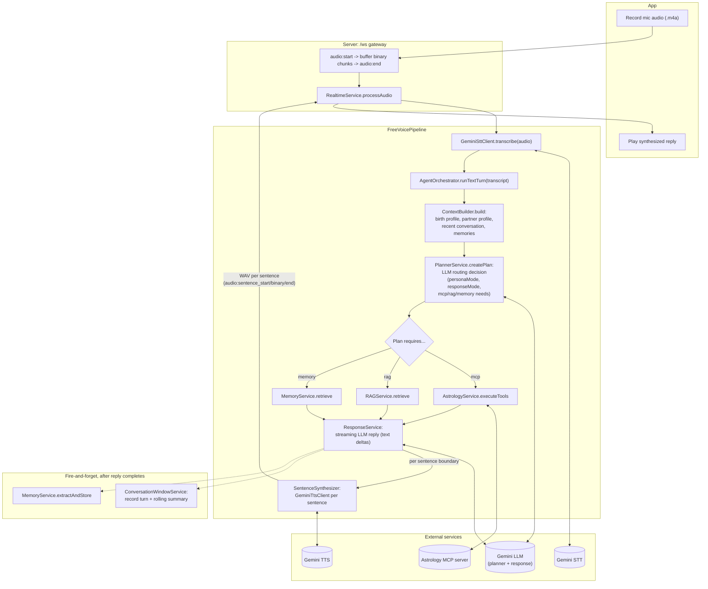

# Free Tier — Voice Pipeline

The baseline cascade: separate STT, planner, MCP/RAG/memory execution, response
generation, and sentence-by-sentence TTS. Slowest tier by design — every step is
a distinct network call, each paying its own latency.

Entry point: `FreeVoicePipeline` (`server/src/modules/realtime/pipelines/free-voice.pipeline.ts`).

## Data Flow Diagram

## Step by step

1. **App records and uploads** — push-to-talk. `audio:start {format:"m4a"}`,
   the full recording as one or more binary WS frames, `audio:end`. The
   gateway buffers the frames and hands the complete `.m4a` blob to
   `RealtimeService.processAudio`.
2. **STT** — `GeminiSttClient.transcribe()` uploads the audio and gets back
   text. This is a full network round trip before anything else can start.
3. **Planner** — `PlannerService.createPlan()` sends the transcript (plus
   conversation context) to the LLM, which returns a structured decision:
   which persona mode to use, whether to call MCP astrology tools, RAG
   knowledge retrieval, or memory search, and which specific tools/queries.
4. **Parallel execution** — whatever the plan asked for runs concurrently:
   `AstrologyService.executeTools` (real MCP calls, birth-profile arguments
   resolved server-side), `RAGService.retrieve`, `MemoryService.retrieve`.
5. **Response generation** — `ResponseService` streams the LLM's reply as
   text deltas, assembled from the planner's decision plus whatever MCP/RAG/
   memory results came back.
6. **Sentence-by-sentence TTS** — as soon as a complete sentence appears in
   the streamed text, `SentenceSynthesizer` sends it to `GeminiTtsClient`
   and streams the resulting WAV audio back to the client immediately,
   framed with `audio:sentence_start`/binary/`audio:sentence_end` — the
   client starts playing the first sentence while later ones are still being
   synthesized, instead of waiting for the whole reply.
7. **Persistence (non-blocking)** — after the reply is fully sent,
   `ConversationWindowService` records both turns and (if the backlog is big
   enough) rolls old messages into a summary; `MemoryService.extractAndStore`
   pulls out any new memorable facts. Neither blocks the user hearing the
   reply.

## Key characteristics

- Every step is a separate network call — STT, planner, response, TTS (one
  call per sentence) — so per-step latency stacks up.
- Hindi transcript shown to the user is cleaned up via `DisplayTranslator`
  before `audio:transcribed` is sent, run concurrently with the agent turn
  continuing (not blocking).
- Fully live-verified and stable — this is the original, longest-running
  tier in this codebase.
