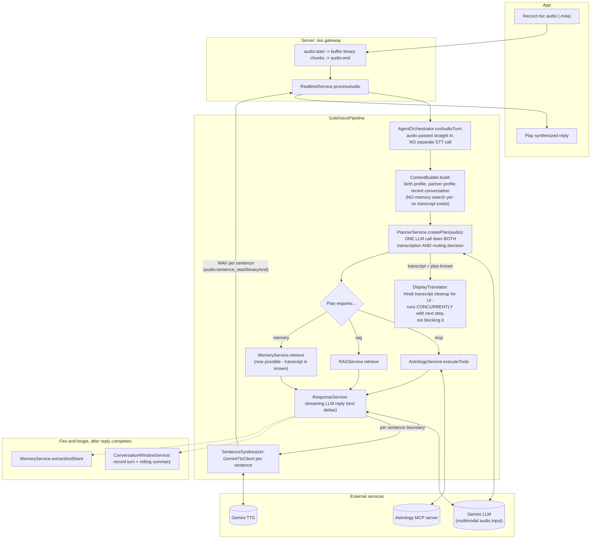

# Gold Tier — Voice Pipeline

Skips Free tier's separate STT call: raw audio goes straight into the planner
call, which transcribes AND produces its routing decision in one LLM call.
Everything downstream (MCP/RAG execution, response generation, sentence-by-
sentence TTS) is identical to Free tier's code.

Entry point: `GoldVoicePipeline` (`server/src/modules/realtime/pipelines/gold-voice.pipeline.ts`).

## Data Flow Diagram

## Step by step

1. **App records and uploads** — identical protocol to Free tier:
   `audio:start {format:"m4a"}`, binary frame(s), `audio:end`. No app changes
   between Free and Gold at all.
2. **No separate STT** — the raw `.m4a` bytes are attached as an inline
   `Part` directly to the planner's LLM call (`LlmGenerateInput.audio`,
   `GeminiLlmClient.toContents`). Gemini decodes the container itself.
3. **Combined transcribe + plan** — `PlannerService.createPlan()` returns
   BOTH the transcript (`plan.transcript`) and the routing decision in one
   response. `AgentOrchestrator.runAudioTurn` yields a `{type:"transcript"}`
   event first, which `GoldVoicePipeline` expects as the very first thing out
   of the agent turn.
4. **Context built without a message** — `ContextBuilder.build()` is called
   *before* the transcript exists (audio hasn't been transcribed yet), so it
   runs without a `message` — memory search is skipped at this point
   (`ContextBuilder`'s own contract: no message, no memory query). Memory
   retrieval happens later, once the plan is known and the transcript exists.
5. **Concurrent display-translation** — once the transcript is known,
   `DisplayTranslator` (Hindi cleanup for the `audio:transcribed` UI text)
   runs *at the same time* as the agent turn continues (MCP/RAG execution,
   response generation already starting) — a manual async-iterator priming
   trick, not sequential blocking.
6. **From here on, identical to Free** — parallel MCP/RAG/memory execution,
   streaming response generation, sentence-by-sentence TTS via the same
   `SentenceSynthesizer`, same persistence/memory-extraction fire-and-forget
   calls at the end.

## Key characteristics

- Saves one network round trip (no separate STT call) compared to Free.
- **Live-measured finding (not theoretical)**: in practice, Gold is **not
  meaningfully faster than Free** — see `ROADMAP.md`'s Phase C. TTS's large
  fixed per-call latency and slow response-generation streaming dominate
  total turn time, and both are identical code shared with Free tier. The
  ~1-2s Gold saves on transcription+planning is small next to that.
- Same sentence-by-sentence audio streaming and Hindi/English enforcement as
  Free (shared `SentenceSynthesizer`, `DisplayTranslator`).
